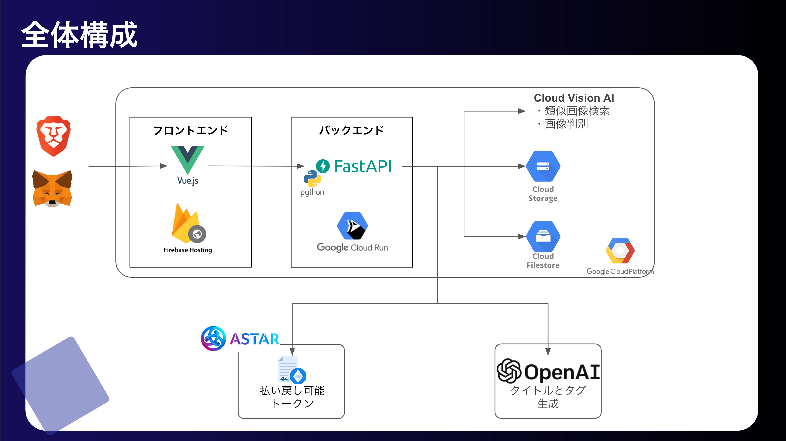

🎗 2023年/AI x Cripto Hackathon Top30 Product 選出
- [参考](https://docs.google.com/spreadsheets/d/1ftUsPOCXQOBegM4b-rdlADiXoxt-gGXbAkwy0J50sJA/edit#gid=130562828)

参考

# LIT ART MARKET

LIT ART MARKET のフロントエンドサーバーです。本アプリケーションには、下記の URL からアクセスしてください

- [LIT ART MARKET](https://hackathon-sandbox-389814.web.app/mypage)

本アプリケーションの概要やコンセプトについては、下記の URL を参照してください

- [Lit Art Market | AKINDO](https://app.akindo.io/communities/1PLX1jmpPUz2nZJL/products/peRXkK3QziGV6AmJ)

## 全体像

LIT ART MARKET は下記のような構成になっています。



上記の全体構成のうち、フロントエンドが本リポジトリの担当範囲です。  
フロントエンド以外のバックエンドは、下記のリポジトリで構築されています。

- [GitHub - teritamas/lit-art-market-server](https://github.com/teritamas/lit-art-market-server)

## Quick Start

### 1. 必要ライブラリのインストール

```sh
npm install
```

### 2. サーバの起動

```sh
npm run serve
```

実行完了後、下記の URL に開発用サーバが立ち上がります。

- http://localhost:8080
